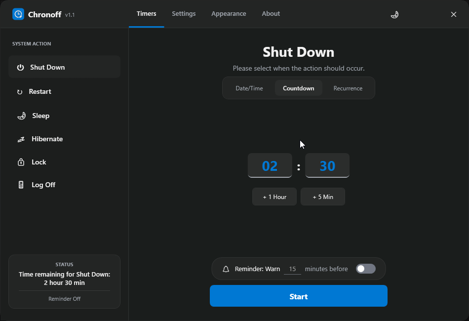
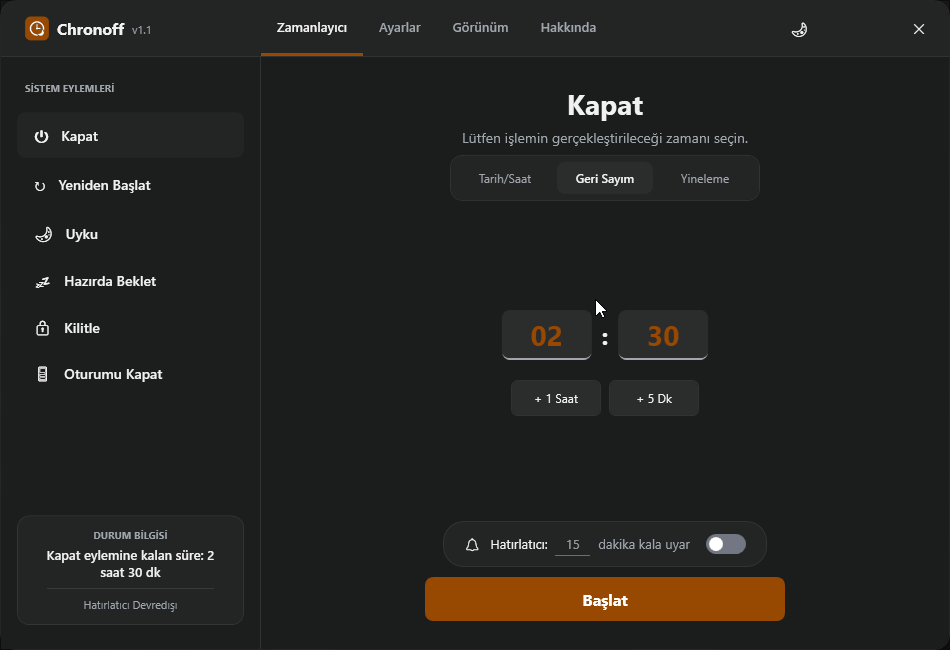

# Chronoff

<p align="center">
  
</p>

<p align="center">
  <strong>Chronoff</strong> is a free, open-source Windows shutdown timer, restart scheduler, sleep timer, hibernation scheduler, and system automation utility built with .NET 10 and WPF. It allows users to schedule shutdown, restart, sleep, hibernate, lock, and log off actions using countdowns, specific dates, or recurring schedules.
</p>

<p align="center">
  <a href="https://github.com/smilefate/Chronoff/releases">
    
  </a>
  
  
  
  
  
</p>

---

## 🌍 Language / Dil Selection
* [English Version](#-english-version)
* [Türkçe Sürüm](#-türkçe-sürüm)

---

# 🇬🇧 English Version

## Table of Contents
- [About](#what-is-chronoff)
- [Features](#key-features)
- [Build & Run](#build-and-publish)
- [FAQ](#faq)
- [License](#license)

## What is Chronoff?
Chronoff is an open-source Windows scheduling application that automates common system power actions.

It can:
- Schedule Windows shutdown
- Schedule restart
- Schedule sleep
- Schedule hibernate
- Schedule lock screen
- Schedule log off
- Run recurring schedules
- Run countdown timers
- Protect active schedules with passwords

Chronoff is written in C#, WPF, and .NET 10.

## Why Chronoff?
Unlike traditional shutdown timer utilities, Chronoff provides:
- Modern Fluent UI
- Native .NET 10 desktop application
- Native AOT compatibility
- Multi-language support (19 languages)
- Password protection
- Windows System Tray integration
- Theme customization
- Lightweight architecture
- Open-source MIT license

## Preview / Demo
<p align="center">
  
</p>

## Key Features
* **Precise Control:** Schedule tasks via specific date/time, countdown, or recurring intervals.
* **Modern UI/UX:** Fluent design with full support for Dark, Light, and System themes.
* **Custom Accent Colors:** Personalize the look with Blue, Teal, or Orange accent options.
* **Interactive Time Adjustments:** Fast increment buttons (`+Hour`, `+Min`) with mouse right-click (or hold right-click + left-click) to decrement values.
* **Security & Integrity:** Optional password protection preventing unauthorized modification or cancellation of active timers.
* **Tray Minimization:** Run quietly in the background within the Windows System Tray with balloon notifications and a context menu.
* **Windows Integration:** Single-instance enforcement (Mutex guard) and startup run preferences.

## System Actions
Chronoff supports the following automated operations:

| Action | Technical Command | Description |
| :--- | :--- | :--- |
| **Shut Down** | `shutdown.exe /s /t 0` | Shuts down the computer immediately. |
| **Restart** | `shutdown.exe /r /t 0` | Restarts the operating system. |
| **Sleep** | `rundll32.exe powrprof.dll...` | Puts the system into a low-power state. |
| **Hibernate** | `shutdown.exe /h` | Saves state to disk and shuts down. |
| **Lock** | `user32.dll LockWorkStation` | Locks the current workstation screen. |
| **Log Off** | `shutdown.exe /l` | Signs out the current user session. |

## Scheduling Modes
1. **Date/Time:** Select a specific future calendar date and time. Ideal for one-off scheduled actions.
2. **Countdown:** Enter a duration in hours and minutes. Countdown starts immediately.
3. **Recurrence:**
   * **Daily:** Repeat every day at a specific time.
   * **Weekly:** Select specific days of the week (e.g., Monday and Friday) to trigger.
   * **Monthly:** Select specific days of the month (e.g., the 1st and 15th) to repeat.

## Technical Architecture
* **Single Instance Controller:** Utilizes a global mutex (`Global\Chronoff_SingleInstance_Mutex_987654`) to prevent duplicate instances from running.
* **Native AOT Compatible JSON Serialization:** Employs a compiled `JsonSerializerContext` (`ChronoffJsonContext`) for fast settings deserialization without runtime reflection.
* **Centralized Timer Service:** A unified `SayacServisi` singleton provides clock ticks using `DispatcherTimer` to synchronize all UI components and triggers.
* **Dynamic Localization Engine:** Features a lightweight dictionary-based parser that hot-reloads interface languages from external `.ini` configuration files.

## Tech Stack
* **Runtime & Framework:** .NET 10, C#, WPF, WinForms (System Tray)
* **API & OS Integration:** DispatcherTimer, Windows Registry, Windows API, Mutex
* **Serialization & Settings:** System.Text.Json Source Generator, JSON, Native AOT
* **Localization:** INI Localization
* **Architecture:** MVVM-inspired architecture

## Directory Structure
```text
Chronoff/
├── Core/
│   ├── BildirimMerkezi.cs   # Handles System Tray notifications & menus
│   ├── SayacServisi.cs      # Core countdown and ticker engine
│   └── SistemEylemleri.cs   # Windows API imports & power execution
├── Servis/
│   ├── AyarServisi.cs       # Settings storage with AOT-compatible JSON serialization
│   ├── BaslangicServisi.cs  # Windows Registry startup execution settings
│   └── DilServisi.cs        # Multi-language dictionary and parser
├── Arayuz/
│   ├── DurumPaneli.cs       # Manages active statuses and scheduled actions info
│   ├── TemaYonetimi.cs      # Theme resources manager (Light/Dark/System)
│   ├── ZamanBirimiYonetimi.cs # Input validations & format converters
│   └── Popup/
│       ├── HatirlatmaPopup  # Notification warning & snooze dialog
│       └── ParolaPopup      # Password verification prompt
├── Languages/               # 19 supported translation files (.ini)
├── App.xaml / App.xaml.cs   # Startup, Shutdown & Mutex single-instance guards
└── Arayuz.xaml / .xaml.cs   # Main application window & event controllers
```

## Build and Publish

### Prerequisites
* [.NET 10.0 SDK](https://dotnet.microsoft.com/download/dotnet/10.0)
* Visual Studio 2022 (with .NET Desktop Development workload) or JetBrains Rider / VS Code.

### Build via CLI
To restore dependencies and build the project:
```bash
dotnet restore
dotnet build -c Release
```

### Publish Single-File Executable
To compile Chronoff into a self-contained, single executable file:
```bash
dotnet publish Chronoff/Chronoff.csproj -c Release -r win-x64 --self-contained true /p:PublishSingleFile=true /p:PublishReadyToRun=true /p:IncludeNativeLibrariesForSelfExtract=true
```

## Supported Languages
Chronoff includes built-in translations for **19 languages**:
English, Turkish, German, French, Spanish, Russian, Chinese, Japanese, Korean, Arabic, Portuguese, Italian, Polish, Ukrainian, Hindi, Azerbaijani, Bengali, Indonesian, Dutch.

## FAQ

### Is Chronoff free?
Yes.

### Is Chronoff open source?
Yes.

### Which Windows versions are supported?
Windows 10 and Windows 11.

### Does Chronoff require installation?
No. Portable builds can be published as a single executable.

### Is Native AOT supported?
Yes.

### Which actions can be scheduled?
Shutdown, restart, sleep, hibernate, lock, and log off.

### Is it lightweight?
Yes. Chronoff is designed as a lightweight desktop utility.

## Development
Chronoff was independently designed and developed by the project author.

Google Gemini 3.5 Flash was used as an AI development assistant for brainstorming, implementation guidance, and code reviews.

Google Stitch was used during UI prototyping and interface exploration.

All architectural decisions, implementation, testing, debugging, and final code were completed and reviewed by the project author.

## Built With
- C#
- .NET 10
- WPF
- Visual Studio 2022
- Google Gemini 3.5 Flash (development assistance)
- Google Stitch (UI prototyping)

## Keywords
- Windows shutdown timer
- Windows restart scheduler
- Sleep timer
- Hibernate scheduler
- Windows automation
- Power management
- WPF application
- .NET desktop
- System tray utility
- Task scheduler alternative
- Open source Windows utility
- Native AOT
- Countdown timer
- Recurring scheduler
- Windows productivity

## License
This project is licensed under the MIT License. See the [LICENSE](LICENSE) file for details.

---

# 🇹🇷 Türkçe Sürüm

<p align="center">
  <strong>Chronoff</strong>; .NET 10 ve WPF ile oluşturulmuş ücretsiz, açık kaynaklı bir Windows kapatma zamanlayıcısı, yeniden başlatma zamanlayıcısı, uyku zamanlayıcısı, hazırda bekletme zamanlayıcısı ve sistem otomasyon aracıdır. Kullanıcıların geri sayımları, belirli tarihleri veya tekrarlayan planları kullanarak kapatma, yeniden başlatma, uyku, hazırda bekletme, kilitleme ve oturumu kapatma eylemlerini zamanlamalarına olanak tanır.
</p>

## İçindekiler
- [Hakkında](#chronoff-nedir)
- [Özellikler](#temel-özellikler-1)
- [Derleme ve Yayınlama](#derleme-ve-yayınlama-1)
- [SSS](#sss-sıkça-sorulan-sorular)
- [Lisans](#lisans-1)

## Chronoff Nedir?
Chronoff, yaygın sistem güç eylemlerini otomatikleştiren açık kaynaklı bir Windows zamanlama uygulamasıdır.

Şunları yapabilir:
- Windows kapatmayı zamanlama
- Yeniden başlatmayı zamanlama
- Uykuyu zamanlama
- Hazırda bekletmeyi zamanlama
- Ekranı kilitlemeyi zamanlama
- Oturumu kapatmayı zamanlama
- Tekrarlayan planları çalıştırma
- Geri sayım sayaçlarını çalıştırma
- Aktif zamanlamaları şifreyle koruma

Chronoff; C#, WPF ve .NET 10 ile yazılmıştır.

## Neden Chronoff?
Geleneksel kapatma zamanlayıcılarının aksine Chronoff şunları sağlar:
- Modern Fluent UI (Akıcı Tasarım)
- Yerel .NET 10 masaüstü uygulaması
- Native AOT uyumluluğu
- Çoklu dil desteği (19 dil)
- Parola koruması
- Windows Sistem Tepsisi (System Tray) entegrasyonu
- Tema özelleştirme
- Hafif mimari
- Açık kaynak MIT lisansı

## Önizleme / Demo
<p align="center">
  
</p>

## Temel Özellikler
* **Hassas Zaman Yönetimi:** Eylemleri belirli tarih/saatte, geri sayım sayacıyla veya tekrarlayan aralıklarla planlayın.
* **Modern Arayüz:** Koyu, Açık ve Sistem temalarını tam olarak destekleyen akıcı ve modern tasarım.
* **Kişiselleştirilebilir Renkler:** Mavi, Turkuaz veya Turuncu vurgu renkleriyle arayüzü kişiselleştirin.
* **Etkileşimli Zaman Ayarları:** Zamanı artıran hızlı butonlar (`+Saat`, `+Dk`) ve sağ tıklama (veya sağ tık basılıyken sol tık) ile zamanı azaltma desteği.
* **Güvenlik ve Kararlılık:** Aktif zamanlayıcıların izinsiz değiştirilmesini veya iptal edilmesini önleyen isteğe bağlı şifre koruması.
* **Sistem Tepsisi Entegrasyonu:** Arka planda sessizce çalışmak için Sistem Tepsisine (System Tray) küçülme, balon bildirimleri ve sağ tık menüsü.
* **Windows Entegrasyonu:** Mutex korumasıyla tek örnekli (single-instance) çalışma kontrolü ve Windows başlangıcında otomatik başlama tercihi.

## Sistem Eylemleri
Chronoff aşağıdaki otomatik eylemleri destekler:

| Eylem | Teknik Komut | Açıklama |
| :--- | :--- | :--- |
| **Kapat** | `shutdown.exe /s /t 0` | Bilgisayarı hemen kapatır. |
| **Yeniden Başlat** | `shutdown.exe /r /t 0` | İşletim sistemini yeniden başlatır. |
| **Uyku** | `rundll32.exe powrprof.dll...` | Sistemi düşük güç moduna alır. |
| **Hazırda Beklet** | `shutdown.exe /h` | Durumu diske kaydeder ve kapatır. |
| **Kilitle** | `user32.dll LockWorkStation` | Geçerli kullanıcı ekranını kilitler. |
| **Oturumu Kapat** | `shutdown.exe /l` | Mevcut kullanıcı oturumunu kapatır. |

## Çalışma Modları
1. **Tarih/Saat:** Gelecekteki belirli bir gün ve saate eylem ayarlamak için kullanılır.
2. **Geri Sayım:** Saat ve dakika cinsinden süre girilerek hemen geri sayım başlatılır.
3. **Yineleme:**
   * **Günlük:** Her gün belirlenen saatte eylem tekrarlanır.
   * **Haftalık:** Haftanın belirlenen günlerinde (örn. Pazartesi ve Cuma) eylem tetiklenir.
   * **Aylık:** Ayın belirlenen günlerinde (örn. 1'i ve 15'i) tekrarlanır.

## Teknik Mimari
* **Tek Örnek Denetleyicisi:** Aynı anda birden fazla programın çalışmasını önlemek için global bir mutex (`Global\Chronoff_SingleInstance_Mutex_987654`) kullanır.
* **Native AOT Uyumlu JSON Serileştirme:** Çalışma zamanında yansıma (reflection) kullanmadan ayarları çok hızlı okuyup yazmak için derlenmiş `JsonSerializerContext` (`ChronoffJsonContext`) kullanır.
* **Merkezi Zamanlayıcı Sayaç Servisi:** Tek bir `SayacServisi` singleton yapısı, tüm arayüz bileşenlerini ve eylem tetikleyicilerini senkronize etmek için `DispatcherTimer` kullanır.
* **Dinamik Yerelleştirme Motoru:** Arayüz dilini harici `.ini` yapılandırma dosyalarından dinamik olarak yükleyen sözlük tabanlı hafif bir yerelleştirici içerir.

## Kullanılan Teknolojiler
* **Çalışma Zamanı ve Framework:** .NET 10, C#, WPF, WinForms (Sistem Tepsisi)
* **API ve İşletim Sistemi Entegrasyonu:** DispatcherTimer, Windows Kayıt Defteri (Registry), Windows API, Mutex
* **Serileştirme ve Ayarlar:** System.Text.Json Source Generator, JSON, Native AOT
* **Yerelleştirme:** INI Yerelleştirme
* **Mimari:** MVVM'den ilham alan mimari

## Klasör Yapısı
```text
Chronoff/
├── Core/
│   ├── BildirimMerkezi.cs   # Sistem tepsisi bildirimleri ve menülerini yönetir
│   ├── SayacServisi.cs      # Merkezi sayaç ve geri sayım motoru
│   └── SistemEylemleri.cs   # Windows API aktarımları ve güç yönetimi komutları
├── Servis/
│   ├── AyarServisi.cs       # AOT uyumlu JSON serileştirme ile ayar yönetimi
│   ├── BaslangicServisi.cs  # Windows Kayıt Defteri (Registry) başlangıç ayarları
│   └── DilServisi.cs        # Çoklu dil sözlüğü ve dil motoru
├── Arayuz/
│   ├── DurumPaneli.cs       # Aktif görevleri ve planlanan durumları yönetir
│   ├── TemaYonetimi.cs      # Açık/Koyu/Sistem temaları yönetimi
│   ├── ZamanBirimiYonetimi.cs # Zaman formatı doğrulama ve dönüştürme mantığı
│   └── Popup/
│       ├── HatirlatmaPopup  # Bildirim uyarısı ve erteleme penceresi
│       └── ParolaPopup      # Yetkisiz iptalleri önlemek için şifre doğrulama penceresi
├── Languages/               # Desteklenen 19 adet yerelleştirme dosyası (.ini)
├── App.xaml / App.xaml.cs   # Başlangıç, kapanış ve Mutex tekli çalışma korumaları
└── Arayuz.xaml / .xaml.cs   # Ana pencere tasarımı ve olay yöneticileri
```

## Derleme ve Yayınlama

### Gereksinimler
* [.NET 10.0 SDK](https://dotnet.microsoft.com/download/dotnet/10.0)
* Visual Studio 2022 (.NET Masaüstü Geliştirme iş yükü ile) veya JetBrains Rider / VS Code.

### CLI ile Derleme
Bağımlılıkları geri yüklemek ve projeyi derlemek için:
```bash
dotnet restore
dotnet build -c Release
```

### Tek Dosya (Single-File) Olarak Yayınlama
Chronoff uygulamasını bağımsız, tek bir çalıştırılabilir dosya (`.exe`) haline getirmek için:
```bash
dotnet publish Chronoff/Chronoff.csproj -c Release -r win-x64 --self-contained true /p:PublishSingleFile=true /p:PublishReadyToRun=true /p:IncludeNativeLibrariesForSelfExtract=true
```

## Desteklenen Diller
Chronoff aşağıdaki **19 dil** için yerleşik çeviri desteği sunar:
İngilizce, Türkçe, Almanca, Fransızca, İspanyolca, Rusça, Çince, Japonca, Korece, Arapça, Portekizce, İtalyanca, Lehçe, Ukraynaca, Hintçe, Azerice, Bengalce, Endonezyaca, Felemenkçe.

## SSS (Sıkça Sorulan Sorular)

### Chronoff ücretsiz mi?
Evet.

### Chronoff açık kaynaklı mı?
Evet.

### Hangi Windows sürümleri destekleniyor?
Windows 10 ve Windows 11.

### Chronoff kurulum gerektirir mi?
Hayır. Taşınabilir (portable) sürümler tek bir çalıştırılabilir dosya olarak yayınlanabilir.

### Native AOT destekleniyor mu?
Evet.

### Hangi eylemler zamanlanabilir?
Kapatma, yeniden başlatma, uyku, hazırda bekletme, kilitleme ve oturumu kapatma.

### Hafif (lightweight) bir uygulama mı?
Evet. Chronoff hafif bir masaüstü aracı olarak tasarlanmıştır.

## Geliştirme Süreci
Chronoff, proje sahibi tarafından bağımsız olarak tasarlanmış ve geliştirilmiştir.

Google Gemini 3.5 Flash, beyin fırtınası, uygulama rehberliği ve kod incelemeleri için bir yapay zeka geliştirme asistanı olarak kullanılmıştır.

Google Stitch, kullanıcı arayüzü prototip oluşturma ve arayüz keşfi aşamalarında kullanılmıştır.

Tüm mimari kararlar, uygulama, testler, hata ayıklama ve nihai kod, proje sahibi tarafından tamamlanmış ve incelenmiştir.

## Nelerle Geliştirildi
- C#
- .NET 10
- WPF
- Visual Studio 2022
- Google Gemini 3.5 Flash (geliştirme desteği)
- Google Stitch (arayüz prototipleme)

## Anahtar Kelimeler
- Windows kapatma zamanlayıcısı
- Windows yeniden başlatma zamanlayıcısı
- Uyku zamanlayıcısı
- Hazırda bekletme zamanlayıcısı
- Windows otomasyonu
- Güç yönetimi
- WPF uygulaması
- .NET masaüstü
- Sistem tepsisi uygulaması
- Görev zamanlayıcı alternatifi
- Açık kaynaklı Windows aracı
- Native AOT
- Geri sayım sayacı
- Tekrarlayan zamanlayıcı
- Windows verimlilik

## Lisans
Bu proje MIT Lisansı ile lisanslanmıştır. Detaylar için [LICENSE](LICENSE) dosyasına göz atabilirsiniz.
